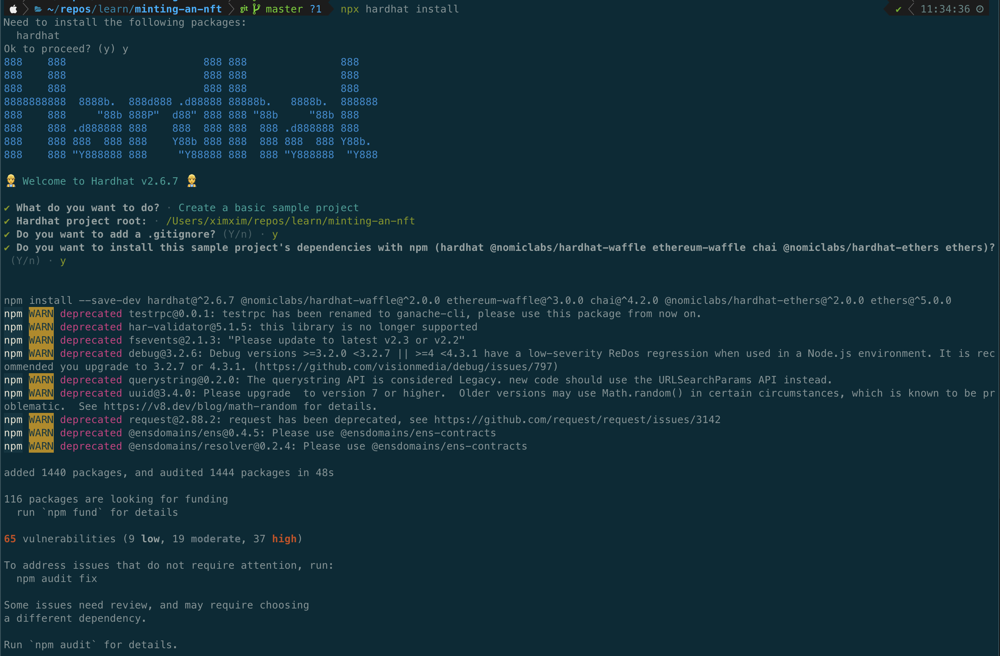
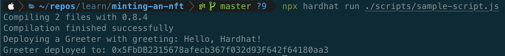

# Mint your own basic off chain NFT

## Description

This project teaches you how to mint your own NFT token. Here are some important packages that we will be using:

### [hardhat](https://www.npmjs.com/package/hardhat)

We will be using hardhat to set up our local blockchain environment to run tests on and mint some NFTs locally.

### [@openzeppelin/contracts](https://www.npmjs.com/package/@openzeppelin/contracts)

This package is a collection of [Solidity](https://docs.soliditylang.org/en/v0.8.9/) contracts that help us mint NFTs.

### [ethers](https://www.npmjs.com/package/ethers)

ethers is a typescript friendly package that we will be using to connect to a user's metamask wallet and perform transactions to mint and NFT.

*Note: Make sure to have [Metamask](https://metamask.io/) installed and working.*

## Stack

We will be using [Solidity](https://docs.soliditylang.org/en/v0.8.9/) to write our smart contract, [nextjs](https://nextjs.org/) for some backend needs along with SSR and [reactjs](https://reactjs.org/) on the front end.

## Versions

- npm: 7.10.0
- node: 16.0.0


## Create a basic NFT minting contract

We will start by create a basic NFT minting contract which will console log a message.

1. Create a directory `mkdir minting-an-nft`
2. Run `npm init -y`
3. Run `npx hardhat install`

Select `Create a basic sample project` and say `Yes` to everything. Your console output would look something like this:



4. Test hardhat installation by running `npx hardhat run ./scripts/sample-script.js`

You should see `Hello Hardhat` printed in your console along with other things:



5. Delete `contracts/Greeter.sol` file. Keep the `contracts` folder.
6. Delete `scripts/sample-script.js` file. Keep the `scripts` folder.
7. Delete `test/sample-test.js` file. Keep the `test` folder.
8. Create `contracts/MintingContract.sol` file and add the content from this [gist](https://gist.github.com/ximxim/1c6129a51eb5b2b175f13d2c00854f6f).
9. Create `scripts/run.js` file and add the following content.

*Note: see this [gist](https://gist.github.com/ximxim/9d294e0ddf8673ef27b3528e6a0a633c) for detailed notes on this script.*

```javascript
const hre = require("hardhat");

async function main() {
  const contract = await hre.ethers.getContractFactory("MintingContract");
  const token = await contract.deploy();

  await token.deployed();

  console.log("Greeter deployed to:", token.address);
}

main()
  .then(() => process.exit(0))
  .catch((error) => {
    console.error(error);
    process.exit(1);
  });
```

10. Run `npx hardhat run ./scripts/run.js`. The output should contain the console log string and a hash that is the address of the contract. This address will be useful for our frontend.


## Start the next app

We need start out next app to create an endpoint which out NFT minting contract can use to general NFT metadata.

1. Run `npx create-next-app@latest --ts` and enter the name of the project. I called it `website`.
2. Run `cd website && yarn dev`. The next app should be started on `localhost:3000`.
3. Replace the content of `website/pages/index.tsx` with the following content.

*Note: see this [gist](https://gist.github.com/ximxim/8c0f1d520aaad3c2705c8b6fb09d0ffb) for detailed notes on this component.*

```jsx
import type { NextPage } from "next";
import Head from "next/head";
import { useState, useCallback, useEffect } from "react";

import styles from "../styles/Home.module.css";

const Home: NextPage = () => {
  const [comments, setComments] = useState<string[]>(["Initialized"]);
  const handleAddComment = useCallback((comment: string, ...args: any[]) => {
    console.log(comment, args);
    setComments((prevState) => [...prevState, comment]);
  }, []);

  useEffect(() => {
    handleAddComment('Ready to code.');
  }, []);

  return (
    <div className={styles.container}>
      <Head>
        <title>Create Next App</title>
        <meta name="description" content="Generated by create next app" />
        <link rel="icon" href="/favicon.ico" />
      </Head>

      <main className={styles.main}>
        <h1 className={styles.title}>
          Welcome to <a href="https://nextjs.org">NFT Minting Example</a>
        </h1>

        <div className={styles.grid}>
          <a href="#" className={styles.card} style={{ width: '100%' }}>
            <h2>Mint Basic NFT</h2>
            <ul>
              {comments.map((comment, index) => (
                <li key={index}>{comment}</li>
              ))}
            </ul>
          </a>
        </div>
      </main>
    </div>
  );
};

export default Home;
```

4. Delete `website/api/hello.ts` file. Keep the folders.
5. Run `mkdir -p "pages/api/tokens" && touch "pages/api/tokens/[id].ts"` while in `website` directory.
6. Write the following code in the new `website/pages/api/tokens[id].ts` file.

*Note: see this [gist](https://gist.github.com/ximxim/1a7c69f9b6c8714f686aa5f6a6f08ca9) for detailed notes on this handler.*

```javascript
import type { NextApiRequest, NextApiResponse } from "next";

async function handler(req: NextApiRequest, res: NextApiResponse) {
  const tokenId = req.query.id as string;

  res.status(200).json({
    image: `https://media.giphy.com/media/X7IoVUJXtO3wk/giphy.gif`,
    name: `Giphy #${tokenId}`,
  });
}

export default handler;
```

7. Test the handler. Run `curl --location --request GET 'localhost:3000/api/tokens/1'`.


## Finish smart contract logic

1. Replace `contracts/MintingContract.sol` content with content in this [gist](https://gist.github.com/ximxim/3d5faff9c6211a71255645d10031eb73).
2. Replace `scripts/run.js` content with the following.

*Note: see this [gist](https://gist.github.com/ximxim/b94e7c3f78436c286ca3c1410da615ad) for detailed notes on this script.*

```javascript
const hre = require("hardhat");

async function main() {
  const contract = await hre.ethers.getContractFactory("MintingContract");
  const token = await contract.deploy('http://localhost:3000/api/tokens/');

  await token.deployed();

  console.log("Greeter deployed to:", token.address);

  let txn = await token.mintBasicNFT();
  await txn.wait();

  txn = await token.mintBasicNFT();
  await txn.wait();
}

main()
  .then(() => process.exit(0))
  .catch((error) => {
    console.error(error);
    process.exit(1);
  });
```
3. Run `npx hardhat run ./scripts/run.js`. The output should look something like this.

*Note: make sure the next app is running, otherwise this script will fail*


## Deploy Next App to Vercel

Feel free to deploy your next app to hosting service of your choice, I am going to deploy Vercel. Follow this [guide](https://www.geeksforgeeks.org/how-to-deploy-next-js-app-to-vercel/) to deploy your next app.

My deployment link is [https://website-kzspirq6d-ximxim.vercel.app/](https://website-kzspirq6d-ximxim.vercel.app/).

Running `curl --location --request GET 'https://website-kzspirq6d-ximxim.vercel.app/api/tokens/1'` successfully returns our NFT metadata.


## Deploy Smart Contract

We will use [Rinkeby](ttps://www.rinkeby.io/) test net. This way we don't use real money when deploying.

1. Run `echo '{"ALCHEMY_KEY": "", "PRIVATE_KEY": ""}' >> secrets.json`.
2. [Create an Alchemy Key](https://docs.alchemy.com/alchemy/introduction/getting-started#1.create-an-alchemy-key) and place it in `secrets.json`.
2. [Get Metamask Private Key](https://metamask.zendesk.com/hc/en-us/articles/360015289632-How-to-Export-an-Account-Private-Key) and place it in `secrets.json`.


3. Modify `hardhat.config.js` and add `networks` key to default export using our `secrets.json` file.

*Note: see this [gist](https://gist.github.com/ximxim/c1b969a3205ac3facad029bed3b39e58) for detailed notes on this script.*

```javascript
const secret = require('./secrets.json');
require("@nomiclabs/hardhat-waffle");

task("accounts", "Prints the list of accounts", async (taskArgs, hre) => {
  const accounts = await hre.ethers.getSigners();

  for (const account of accounts) {
    console.log(account.address);
  }
});

module.exports = {
  solidity: "0.8.4",
  networks: {
    rinkeby: {
      url: secret.ALCHEMY_KEY,
      accounts: [secret.PRIVATE_KEY],
    },
  }
};
```

4. Run `cp scripts/run.js scripts/deploy.js` to create a deploy script.
5. Replace `http://localhost:3000` in `scripts/deploy.js` with your vercel url `https://website-kzspirq6d-ximxim.vercel.app/`

*Note: see this [gist](https://gist.github.com/ximxim/7ae2c7d25c5d6b6ef1fdc7369f2ad406) for detailed notes on this script.*

```javascript
const hre = require("hardhat");

async function main() {
  const contract = await hre.ethers.getContractFactory("MintingContract");
  const token = await contract.deploy('https://website-kzspirq6d-ximxim.vercel.app/api/tokens/');

  await token.deployed();

  console.log("Greeter deployed to:", token.address);

  let txn = await token.mintBasicNFT();
  await txn.wait();

  txn = await token.mintBasicNFT();
  await txn.wait();
}

main()
  .then(() => process.exit(0))
  .catch((error) => {
    console.error(error);
    process.exit(1);
  });
```

6. Run `npx hardhat run --network rinkeby ./scripts/deploy.js` in order to deploy to rinkeby network.

*Note: Keep track of the address hash, we will need this to make requests from the frontend.*


The contract is deployed and an NFT should be minted at this point. Try navigating to this link `https://testnets.opensea.io/assets/<CONTRACT_ADDRESS>/1`.

Also, try `https://rinkeby.etherscan.io/address/<CONTRACT_ADDRESS>`.